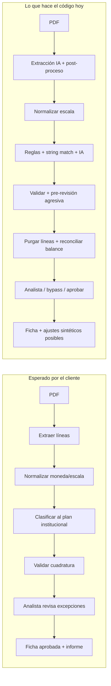

# Evaluación del sistema FFA vs. lógica esperada por el cliente

**Fecha:** 14 de septiembre de 2026  
**Alcance:** auditoría de punta a punta del código (API, workers, pipeline, UI de revisión) contrastado con `docs/ESPECIFICACION-FUNCIONAL-FFA.md` y la ayuda del producto.

---

## Veredicto ejecutivo

| Pregunta | Respuesta |
|---|---|
| ¿El sistema **intenta** hacer lo que el cliente pidió? | **Sí** — existe un pipeline completo PDF → líneas → plan de cuentas → validación → revisión → ficha → informe. |
| ¿Lo hace **correctamente y de forma confiable** hoy? | **Parcialmente** — la arquitectura está, pero hay bugs, atajos y heurísticas agresivas que explican **diferencias grandes** entre el PDF y los números del sistema. |
| ¿Cumple la promesa de “revisión por excepción”? | **Parcialmente** — la UI filtra pendientes, pero la pre-revisión automática borra líneas, la IA cierra dudas sin umbral, y existe un bypass masivo de aprobación. |
| ¿Cada línea del PDF termina mapeada a un rubro institucional? | **No siempre** — se eliminan líneas, se inyectan ajustes sintéticos, y pueden quedar líneas sin rubro hasta intervención humana. |

**Conclusión:** el sistema **no es hoy un reemplazo fiable de la transcripción manual**. Funciona como prototipo avanzado con lógica orientada a “hacer cuadrar” más que a “replicar fielmente el documento”. Las diferencias que ves no son solo de UI: tienen causa en extracción, escala, purga de líneas y reconciliación automática.

---

## Flujo esperado vs. flujo real



| Etapa | Lo que el cliente espera | Lo que hace el sistema | ¿Alineado? |
|---|---|---|---|
| Carga | Recibir PDF, abrir expediente | ✅ Implementado (`POST /casos/upload`) | ✅ |
| Extracción | Leer **todas** las filas y montos del documento | IA multimodal página a página; deduplicación; controles aritméticos limitados | ⚠️ Parcial |
| Normalización | Detectar moneda, escala (miles/millones), signos, ejercicio | Moneda/signos en extract; escala en cola `normalize` | ⚠️ Parcial |
| Clasificación | Cada línea → rubro del **plan institucional único** | Cascada: criterio contribuyente → reglas → similitud texto → IA acotada | ⚠️ Parcial |
| Validación | Cuadratura verificada, semáforo de confianza | Cuadratura por “páginas objetivo”; ajustes plug; semáforo multi-fuente | ⚠️ Parcial |
| Revisión | Solo excepciones (< umbral ~85%) | UI filtra pendientes, pero hay bypass y cierre parcial | ⚠️ Parcial |
| Aprobación | Ficha canónica trazable al PDF | Snapshot por rubro; cuadratura “confirmada” puede ser bypass | ⚠️ Parcial |
| Informe | Documento para comité | HTML + narrativa IA (con fallback silencioso a plantilla) | ✅ Parcial |

---

## Evaluación por etapa

### 1. Carga documental ✅

**Implementado:** upload multipart, deduplicación SHA-256, encolado a `preprocess`, expediente con pipeline visible.

**Archivos clave:** `apps/api/src/routes/casos.ts`, `apps/worker/src/processors/preprocess.ts`

**Observación:** funciona; no es la fuente principal de diferencias numéricas.

---

### 2. Extracción IA ⚠️ — fuente crítica de errores

**Implementado:**
- Proveedor OpenAI/Anthropic con fallback; mock si no hay API key.
- Prompt estructurado: `tipoDocumento`, `metadata`, `lineas[{denominacion, monto, pagina, confianza}]`.
- Post-proceso: parseo de montos, signos por regex de denominación, deduplicación, 4 controles aritméticos (activo=PP, corriente+NC, ganancia bruta).

**Archivos clave:**
- `apps/worker/src/processors/extract.ts`
- `packages/pipeline/src/extract/post-process-extract.ts`
- `packages/pipeline/src/extract/extract-arithmetic-checks.ts`

**Problemas confirmados:**

| # | Problema | Impacto |
|---|---|---|
| E1 | **`requiereRevision` siempre `false` al insertar líneas** (`extract.ts:294`) aunque el post-proceso marque revisión por control aritmético fallido | Controles de extract no llegan al analista |
| E2 | **Mock silencioso** sin API key — usa fixtures JSON, no el PDF real | Casos “procesados” con datos de ejemplo |
| E3 | **Pérdida de campos** al persistir en `LineaContableModel` (naturaleza, signoContable, motivoRevision, etc.) | Trazabilidad empobrecida en etapas posteriores |
| E4 | Controles aritméticos dependen de **regex de denominación**; si el PDF usa otro texto, no corren | Falsos “OK” silenciosos |
| E5 | Heurística `parseMontoLocale` puede multiplicar ×1000 montos legítimos pequeños | Montos inflados |

---

### 3. Normalización (moneda / escala / signos) ⚠️ — fuente crítica

**Implementado:**
- Moneda y escala: detección en extract (`detect-moneda-escala.ts`) + aplicación de multiplicador en `normalize-lines.ts` (`unidades=1`, `miles=1000`, `millones=1e6`).
- Signos: inferidos por naturaleza contable en extract (`normalizar-signos-contables.ts`).
- Período/ejercicio: `normalizarPeriodo`.

**Problema confirmado — escala indeterminada:**

```typescript
// packages/pipeline/src/normalize/normalize-metadata.ts — evaluarEscala()
// Si escala === "indeterminada", SIEMPRE devuelve "indeterminada"
// El chequeo de magnitud solo cambia el mensaje de log, no el resultado
return "indeterminada"; // multiplicador = 1
```

**Impacto:** si la IA no detecta “millones” o “miles”, los montos quedan **1000× o 1.000.000× más chicos** que en el PDF. Se marcan para revisión, pero el analista ve números completamente distintos al documento.

---

### 4. Clasificación al plan de cuentas ⚠️

**Implementado (cascada en `classify-lines.ts`):**

1. Criterio aprobado del contribuyente → confianza 98%
2. Regla institucional (patrón/regex) → confianza 95%
3. Matching “semántico” = **similitud de strings** (igualdad, contención, alias, Levenshtein-ish) — **no embeddings**
4. Resolución asistida → confianza bajo umbral, `requiereRevision=true`
5. IA generativa (Claude/GPT) → **solo en revisión/pre-revisión**, no en primer pase

**Plan de cuentas:**
- Modelo versionado (`PlanCuentasVersionModel` + `RubroInstitucionalModel`).
- Una versión vigente global; snapshot en `caso.planCuentasVersionId` al clasificar.
- Rubros asignables = hojas sin hijos (códigos ≠ 1, 2, 3).

**Problemas:**

| # | Problema | Impacto |
|---|---|---|
| C1 | “Semántico” es heurística de texto, no embeddings como dice la spec | Muchas líneas quedan sin rubro o mal rubro |
| C2 | IA acotada a shortlist ≤25 rubros; puede elegir rubro agrupador y corregir a “hermano” con confianza 55 | Clasificación estructuralmente incorrecta |
| C3 | **`aplicarSugerenciaEnLinea` fuerza `requiereRevision=false` siempre** (`clasificacion-ia.ts:144`) | IA cierra líneas dudosas sin pasar al analista |
| C4 | Líneas sin rubro **no bloquean** el pipeline; solo warning | Casos avanzan incompletos |

**¿Clasifica según el plan de cuentas?** Sí, **cuando logra asignar** — siempre a rubros del plan vigente. Pero no garantiza que **todas** las líneas del PDF queden mapeadas.

---

### 5. Validación y cuadratura ⚠️ — fuente crítica de “diferencias que cuadran”

**Implementado:**
- `validateCase`: cuadratura activo vs pasivo+patrimonio, retiros en activo, reglas H.2–H.20, subtotales contiguos (H.17).
- Semáforo: rojo (critical/cuadratura fail), amarillo (warnings/bajo umbral), verde.
- Pre-revisión (`pre-revision-orchestrator.ts`) **después** de validate: purga, reclasifica, reconcilia, re-valida.

**Cuadratura “inteligente” (problemática):**
- Detecta “testigo” del balance buscando líneas tipo “Total del activo” / “Total del pasivo y patrimonio”.
- Suma **solo páginas objetivo** (±1 del testigo), excluyendo ER, flujo, notas, etc.
- Si no hay testigo → modo global sumando **todo el documento** (incluye ER mezclado con balance).

**Reconciliación automática (`balance-reconciliar.ts`):**
- Reclasifica por regex hardcodeados (patrimonio/pasivo/activo).
- Elimina duplicados de escala ×1000.
- **Inserta líneas sintéticas** “Ajuste de cuadratura (reconciliación automática)” en rubros genéricos 1.9 / 3.9.

**Impacto directo en diferencias:**

> El sistema puede mostrar cuadratura OK y semáforo verde **inyectando ajustes ficticios** o **borrando líneas**, en lugar de reflejar fielmente el PDF. La diferencia que ves entre PDF y sistema puede estar “tapada” por estos mecanismos.

---

### 6. Pre-revisión automática ⚠️ — contradice “cada línea mapeada”

**Implementado en `pre-revision-orchestrator.ts`:**
- `purgarLineasSinSentido`, `purgarPaginasNoBalance`, `purgarLineasFueraPaginasBalance`, `purgarLineasEscalaIncorrecta`
- `corregirClasificacionesAbsurdas` (reglas hardcodeadas por emisor/formato)
- Clasificación IA masiva de dudosas
- Reconciliación de balance

**Problema:** en vez de clasificar o marcar para revisión, **elimina líneas del PDF** con heurísticas regex. Esas líneas desaparecen de la UI de revisión (solo quedan en auditoría). No hay métrica de “líneas perdidas vs. extraídas”.

---

### 7. Revisión humana ⚠️

**Implementado (sólido en capacidades):**
- Editar metadatos, líneas (monto, denominación, rubro), crear manual, reclasificar masiva, sugerir/aplicar IA por línea.
- UI con filtros: pendientes (default), sin rubro, duplicados, ruido.
- Análisis de balance + botón reconciliar.

**Problemas vs. “revisión por excepción”:**

| # | Problema | Archivo |
|---|---|---|
| R1 | **`resolverPendientesRevision`** sube confianza al umbral y aprueba líneas pendientes **sin revisión real** | `revision.ts:416-479` |
| R2 | Confirma **todas** las validaciones warning/critical en bloque | `revision.ts:454-466` |
| R3 | Usado en flujo de **“cierre parcial”** desde la UI | `RevisionView.vue`, `casos-revision.ts` |
| R4 | Post-aprobación: **no se puede editar** una línea; solo “Reiniciar a foja cero” (reproceso total) | `revision.ts:407-414` |

**Lo que sí funciona:** el filtro default `soloRevision=true` en `RevisionSplitView.vue` muestra solo pendientes. La lógica de `requiereRevision` en clasificación por score/umbral es real.

---

### 8. Aprobación, indicadores e informe ✅/⚠️

**Implementado:**
- Ficha canónica con snapshot por rubro, historial de versiones, indicadores calculados (`ficha-indicadores.ts`).
- Informe HTML con plantilla, narrativa IA (Anthropic) con fallback silencioso a plantilla estática.
- Gate `puedeAprobarFicha` con checks de metadatos, pendientes, cuadratura — **saltables** con `ignorarValidacionesPendientes`.

**Gap:** cuadratura “confirmada por analista” (incluso vía bypass) cuenta como OK en la ficha aprobada.

---

## Top 10 causas de diferencias grandes PDF vs. sistema

Ordenadas por probabilidad e impacto:

| # | Causa | Mecanismo |
|---|---|---|
| 1 | **Escala no detectada** | Montos ×1 en vez de ×1000 o ×1.000.000 |
| 2 | **Líneas eliminadas en pre-revisión** | Montos del PDF desaparecen de la base |
| 3 | **Ajustes sintéticos de cuadratura** | Sistema “cuadra” con partidas que no existen en el PDF |
| 4 | **Testigo de balance no detectado** | Cuadratura suma páginas incorrectas (ER mezclado con balance) |
| 5 | **Extracción IA incompleta/errónea** | Filas omitidas o montos mal leídos |
| 6 | **Clasificación incorrecta activo/pasivo/patrimonio** | Totales por rubro no coinciden con estructura del PDF |
| 7 | **Deduplicación/colapso ×1000** | Elimina líneas legítimas (columnas comparativas) |
| 8 | **Signos mal inferidos** | Naturaleza “neutro” si denominación no matchea regex |
| 9 | **Mock/fixtures sin API key** | Datos de ejemplo en vez del PDF |
| 10 | **Bypass de aprobación / cierre parcial** | Analista aprueba sin corregir diferencias reales |

---

## Matriz de cumplimiento vs. especificación funcional

| Requisito (spec) | Estado | Notas |
|---|---|---|
| O2 — Extracción y normalización | ⚠️ Parcial | Existe; escala y signos frágiles |
| O3 — Clasificación bajo plan único | ⚠️ Parcial | Cascada OK; no garantiza 100% cobertura |
| O4 — Validación y umbral confianza | ⚠️ Parcial | Semáforo existe; múltiples fuentes inconsistentes |
| O5 — Revisión por excepción | ⚠️ Parcial | UI sí; bypass y pre-revisión lo debilitan |
| O6 — Indicadores e informe | ✅ Mayormente | Funcional con fallback silencioso en narrativa |
| E.1–E.18 — Plan de cuentas institucional | ✅ Mayormente | Versionado OK; enforcement de hoja asignable básico |
| F.1 — Cada línea a rubro institucional | ❌ No garantizado | Líneas borradas, sin rubro, o ajustes sintéticos |
| F.3 — Coincidencia semántica | ❌ Mal implementado | Hoy: similitud de strings; **recomendado: Claude contextual**, no embeddings |
| P.1 — Trazabilidad cifra → documento | ⚠️ Parcial | Ajustes sintéticos cumplen forma pero no espíritu |
| D.6/D.7 — Detección escala indeterminada | ❌ Bug | `evaluarEscala` no infiere; solo loguea |

---

## Qué está bien hecho (no reescribir)

1. **Arquitectura pipeline** desacoplada (API + workers BullMQ + colas por etapa).
2. **Plan de cuentas versionado** con snapshot por caso.
3. **Estación de revisión** con edición inline, filtros, IA por línea, análisis de balance.
4. **Ficha canónica + historial** al aprobar.
5. **UI del expediente** con pipeline amigable, semáforo visual, historial.
6. **Infraestructura IA ya existe** — Anthropic en extracción (`anthropic-provider.ts`), clasificación (`sugerir-ia.ts`), metadatos, informe (`informe-ia.ts`); falta usarla como **motor principal** en vez de heurísticas.

---

## Dirección estratégica recomendada: Claude (Anthropic) como motor de análisis

**Problema de fondo:** hoy ~70% del “inteligente” del pipeline son **regex, similitud de strings y reglas hardcodeadas** pensadas para PDFs concretos (Cencosud, Falabella, etc.). Eso no escala y explica diferencias con documentos nuevos.

**Propuesta:** invertir la pirámide. **Claude resuelve cada análisis sobre el archivo**; el código solo orquesta, valida esquema, persiste y aplica umbrales. Menos heurística, menos “semántica” de strings, más razonamiento contextual sobre el documento completo.

### Estado actual vs. objetivo

| Etapa | Hoy (heurística) | Objetivo (Claude primero) |
|---|---|---|
| Extracción | OpenAI primario; post-proceso con regex de signos, dedupe, 4 checks aritméticos | **Anthropic por defecto** (`ANTHROPIC_EXTRACT_MODEL`); post-proceso mínimo (solo parseo numérico determinista) |
| Moneda / escala / ejercicio | `detect-moneda-escala.ts` + `evaluarEscala` roto | **Claude lee encabezado + contexto** en una pasada dedicada; código solo valida enum |
| Signos contables | `inferNaturaleza` por regex de denominación | **Claude asigna naturaleza y signo** por línea con contexto de sección (activo/pasivo/ER) |
| Clasificación | Cascada: criterio → regla → `similitudTexto` → IA solo al final | **Claude clasifica todas las líneas** con plan completo (o por sección); reglas/criterio solo como cache confirmado |
| Cuadratura / testigo | Regex “Total del activo”, páginas objetivo, ajustes plug | **Claude identifica totales y estructura** del balance; reconciliación propone, no impone |
| Pre-revisión | `purgarLineas*`, `corregirClasificacionesAbsurdas` (regex por emisor) | **Claude evalúa cada línea**: ¿es contable? ¿rubro correcto? ¿ruido OCR? — sin `deleteMany` |
| Informe | Claude con fallback silencioso a plantilla | Claude obligatorio; sin fallback silencioso |

### Qué conservar sin IA (determinista)

- Validación de esquema JSON y tipos.
- Multiplicador de escala una vez declarado (`×1000`, `×1e6`).
- Suma aritmética de cuadratura (activo vs pasivo+patrimonio) — **el cálculo es código; la interpretación del documento es Claude**.
- Plan de cuentas: solo rubros del plan vigente (constraint en prompt + validación post-respuesta).
- Auditoría, versionado, umbrales de confianza, gates de aprobación humana.

### Qué eliminar o degradar

| Componente | Acción |
|---|---|
| `matchSemantico` / `similitudTexto` en `classify-lines.ts` | Reemplazar por Claude; mantener solo como fallback offline sin API |
| `scoreRubroCandidates` + shortlist heurístico | Claude recibe sección relevante del plan (activo/pasivo/ER) filtrada por `estadoFinancieroLinea`, no top-25 por string match |
| `PATRIMONIO_PATTERNS` / `PASIVO_PATTERNS` en `reconcile-balance.ts` | Claude propone reclasificación con evidencia (página, denominación) |
| `purgarLineasSinSentido`, `purgarPaginasNoBalance`, etc. | Claude marca `tipoLinea: contable|ruido|total|nota` — persistir todo, no borrar |
| `inferNaturaleza` regex | Claude en extract o paso `interpretar-signos` |
| `enriquecerMonedaEscala` regex sobre texto | Claude en paso `interpretar-metadatos` |
| `corregirClasificacionesAbsurdas` hardcodeado | Eliminar; misma lógica vía prompt de revisión Claude |
| Ajustes sintéticos automáticos (`crearAjuste`) | Claude explica diferencia; analista confirma o corrige |

---

## Recomendaciones de solución (priorizadas)

### P0 — Parar el sangrado (bugs + política IA)

1. **Fix `requiereRevision` en extract** — respetar el flag del post-proceso al insertar líneas (`extract.ts:294`).
2. **Anthropic como proveedor por defecto** — `extractionProvider: "anthropic"`, `ANTHROPIC_API_KEY` obligatoria en prod; banner si cae a mock.
3. **Desactivar ajustes sintéticos automáticos** — no insertar “Ajuste de cuadratura” sin confirmación del analista.
4. **Prohibir `deleteMany` de líneas en pre-revisión** — Claude marca propósito de línea; código persiste con flags.
5. **Respetar umbral post-IA** — `aplicarSugerenciaEnLinea` mantiene `requiereRevision=true` si `confianza < umbral`.

### P1 — Claude en cada análisis del archivo

#### P1.1 Extracción (ya parcialmente implementado)

- **Unificar en Anthropic** para visión de página (`anthropic-provider.ts`); OpenAI solo fallback explícito con log.
- **Prompt enriquecido por paso:** pedir explícitamente `moneda`, `escala`, `ejercicio`, `tipoDocumento`, `seccionPagina` por línea, `naturalezaContable`, `esTotal`, `esSubtotal`.
- **Reducir post-proceso regex** en `post-process-extract.ts`: delegar signos y naturaleza a lo que devolvió Claude; conservar solo `parseMontoLocale` y dedupe conservador.
- **Archivos:** `packages/pipeline/src/extract/anthropic-provider.ts`, `prompts.ts`, `post-process-extract.ts`.

#### P1.2 Interpretación de metadatos (reemplaza heurística de escala)

- Nuevo paso **`interpretar-metadatos-claude`** después de extract (worker o inline en API):
  - Input: transcripción de encabezado + primeras líneas + imagen página 1.
  - Output JSON: `{ moneda, escala, ejercicio, periodo, razonSocial, rut, confianza, razonamiento }`.
  - Reemplaza `evaluarEscala` roto y `enriquecerMonedaEscala` regex.
- Persistir `razonamiento` en `extractMetadata` para trazabilidad en expediente.
- **Archivos nuevos sugeridos:** `packages/pipeline/src/interpret/claude-metadatos.ts`.

#### P1.3 Clasificación (reemplaza cascada heurística)

- **Invertir orden:** en `classify.ts`, para cada línea (o batch por página):
  1. Si existe **criterio aprobado del contribuyente** (match exacto previo) → usar directo (cache humano).
  2. Si no → **`sugerirClasificacionIa` con Anthropic** pasando:
     - denominación, monto, página, sección;
     - **rubros filtrados por `estadoFinancieroLinea`** (no shortlist por `similitudTexto`);
     - contexto: 5–10 líneas vecinas de la misma página;
     - reglas institucionales como **hints en el prompt**, no como decisión automática.
  3. Eliminar o dejar solo offline: `matchSemantico`, `resolveAsistida`, `scoreRubroCandidates` como decisor.
- Batch: clasificar página completa en una llamada Claude (menos costo, mejor coherencia entre líneas de la misma sección).
- **Archivos:** `packages/pipeline/src/classify/sugerir-ia.ts`, `classify-lines.ts`, `apps/worker/src/processors/classify.ts`.

#### P1.4 Validación y cuadratura (Claude interpreta, código suma)

- Nuevo paso **`analizar-estructura-balance-claude`** antes de `validateCase`:
  - Input: líneas extraídas + imagen de páginas de balance.
  - Output: `{ paginasBalance[], totalesDeclarados[], lineasRuido[], lineasNotas[], diferenciasDetectadas[], confianza }`.
  - Reemplaza `detectarTestigosBalance` regex y `inferirPaginasBalanceObjetivo`.
- `validateCase` usa las páginas que Claude identificó; suma sigue siendo determinista.
- **Reconciliación:** Claude propone `{ lineaId, rubroSugerido, motivo }[]`; analista acepta en UI — no `crearAjuste` automático.
- **Archivos:** `packages/pipeline/src/validate/balance-cuadratura.ts`, `packages/db/src/services/balance-reconciliar.ts`, nuevo `packages/pipeline/src/validate/claude-estructura-balance.ts`.

#### P1.5 Pre-revisión (reemplaza purgas regex)

- Reescribir `pre-revision-orchestrator.ts`:
  - Una llamada Claude por caso (o por documento): “revisá estas N líneas contra el PDF; indicá cuáles son ruido, cuáles mal clasificadas, cuáles faltan”.
  - Output estructurado → actualizar flags (`requiereRevision`, `motivoRevision`, `excluirDeCuadratura`), **nunca borrar**.
  - Clasificación IA masiva solo para líneas que Claude marque `sin_rubro` o `rubro_dudoso`.
- Eliminar: `purgarLineasSinSentido`, `purgarPaginasNoBalance`, `corregirClasificacionesAbsurdas`.

#### P1.6 Revisión asistida (ya parcial — ampliar)

- Botón “Analizar caso con IA” en `RevisionView`: Claude lee PDF + ficha actual → informe de discrepancias (línea a línea vs PDF).
- Cuadratura: Claude explica **por qué** no cuadra (escala, línea faltante, rubro mal imputado) en lenguaje natural + JSON accionable.
- **Archivos:** `apps/api/src/services/revision.ts`, `RevisionView.vue`, `BalanceDiagnosticoPanel.vue`.

### P2 — Gobernanza, costo y calidad IA

11. **Modelo único configurable:** `ANTHROPIC_MODEL` / `ANTHROPIC_EXTRACT_MODEL` (ej. `claude-sonnet-4-6`) para extract, classify, validate, informe — un solo proveedor en prod.
12. **Registrar todas las llamadas** en `ia-llamada-service.ts` con etapa, tokens, latencia, casoId — visible en expediente (“IA usada en extracción, clasificación, cuadratura”).
13. **Cache de criterios aprobados** — la única “memoria” no-IA: si el analista confirmó “Caja y Bancos → 1.1.1”, no volver a llamar Claude para esa denominación + contribuyente.
14. **Restringir `resolverPendientesRevision`** a admin; nunca en cierre parcial sin revisión línea a línea.
15. **Informe:** narrativa Claude obligatoria; badge visible “Análisis generado por IA” vs plantilla.
16. **Tests de regresión por PDF** — golden files: comparar output Claude+pipeline vs. ficha manual del cliente; medir % líneas correctas, no solo “cuadra”.

### P2 — Qué NO hacer

- **No agregar embeddings / vectores** como capa intermedia — añade complejidad y otro sistema de “semántica” que el usuario quiere evitar. Claude **es** el matcher semántico.
- **No mantener regex como decisor principal** — solo como validación post-Claude (ej. “¿el rubro devuelto existe en el plan?”).
- **No expandir listas de patrones por emisor** (`PATRIMONIO_PATTERNS`, etc.) — cada PDF nuevo no debería requerir código nuevo.

---

## Roadmap sugerido (4 fases)

| Fase | Entrega | Impacto esperado |
|---|---|---|
| **F1** (1–2 sem) | P0 + Anthropic default + fix escala vía Claude metadatos | Montos con escala correcta; menos mock silencioso |
| **F2** (2–3 sem) | Clasificación Claude-first; eliminar `matchSemantico` como decisor | Rubros correctos sin depender de nombre exacto |
| **F3** (2–3 sem) | Estructura balance + pre-revisión Claude; sin purgas ni ajustes auto | Cuadratura interpretable; líneas no desaparecen |
| **F4** (1–2 sem) | Diagnóstico en revisión + informe + métricas IA | Analista ve “por qué difiere” antes de aprobar |

**Costo estimado:** más llamadas API por caso (extracción ya es por página; clasificación puede batch por página; metadatos/estructura = 2–3 llamadas extra por documento). Compensación: menos horas de analista y menos código heurístico que mantener.

---

## Respuesta directa a la pregunta del negocio

> *“¿Leo el archivo, obtengo líneas, después las clasifico según nuestro plan de cuentas?”*

**Sí, esa es la lógica de diseño y lo que el código intenta hacer.** Pero hoy el camino real incluye pasos que el cliente **no pidió** y que explican las diferencias:

- **Purgar** líneas en vez de clasificarlas.
- **Reconciliar** insertando ajustes ficticios para cuadrar.
- **Normalizar escala** de forma incompleta (bug en inferencia).
- **Cerrar** líneas dudosas con IA sin pasar al analista.

Por eso ves números muy distintos al PDF: no es solo que “la clasificación falle”, sino que el pipeline **modifica, elimina o inventa** datos para llegar a un balance que cuadre.

**Dirección de solución acordada:** menos regex y menos matching de strings; **más Claude (Anthropic) en cada etapa de análisis del archivo**, con el código limitado a orquestar, validar esquema y sumar. Ver sección *Dirección estratégica recomendada* y roadmap F1–F4.

**Implementación unificada (F1–F4 aplicadas):** ver [`SOLUCION-UNIFICADA-IA.md`](./SOLUCION-UNIFICADA-IA.md) — extracción/clasificación Claude-first, pre-revisión sin purgas, banner fallback heurístico, tests golden.

---

## Archivos revisados (referencia)

| Área | Archivos principales |
|---|---|
| Upload / casos | `apps/api/src/routes/casos.ts` |
| Workers | `apps/worker/src/processors/{extract,normalize,classify,validate}.ts` |
| Pipeline extract | `packages/pipeline/src/extract/*` |
| Pipeline normalize | `packages/pipeline/src/normalize/*` |
| Clasificación | `packages/pipeline/src/classify/classify-lines.ts`, `apps/api/src/services/clasificacion-ia.ts` |
| Validación | `packages/pipeline/src/validate/*`, `apps/worker/src/processors/validate.ts` |
| Pre-revisión | `packages/db/src/services/pre-revision-orchestrator.ts` |
| Reconciliación | `packages/db/src/services/balance-reconciliar.ts` |
| Revisión / aprobación | `apps/api/src/services/revision.ts`, `apps/api/src/routes/casos-revision.ts` |
| UI revisión | `apps/web/src/views/RevisionView.vue`, `RevisionSplitView.vue` |
| Especificación | `docs/ESPECIFICACION-FUNCIONAL-FFA.md` |

---

*Documento generado por auditoría de código. No sustituye pruebas con casos reales del cliente (UAT), pero identifica las causas estructurales de discrepancia observadas.*
